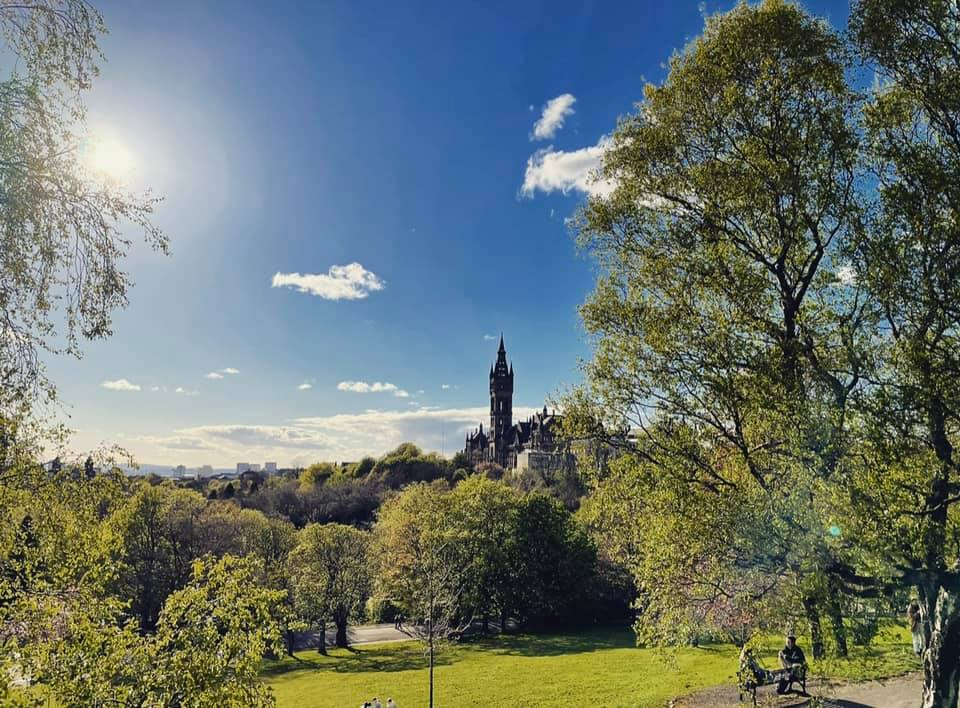

# Our Door Is Always Open {-}

---

You can find the Spotify playlist through this link with all the tunes that represent the year for you.....keep dancing!   

<a href = "https://open.spotify.com/playlist/62q7PxNnTh23mFUv8wiLee?si=8336a91f76dd4ea4" target = "_blank">UofGPsych2021 playlist</a>

A huge thank you to all the staff that contributed to the Roll Call, Carolina Kuepper-Tetzel for compiling and to Phil McAleer for writing the script for this book. I am very glad to be part of the UofG Psychology team. 

---

 
 
**The Sun Shining on Campus**

