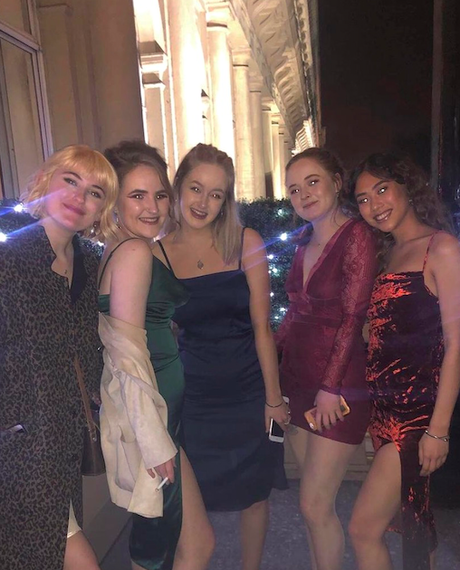
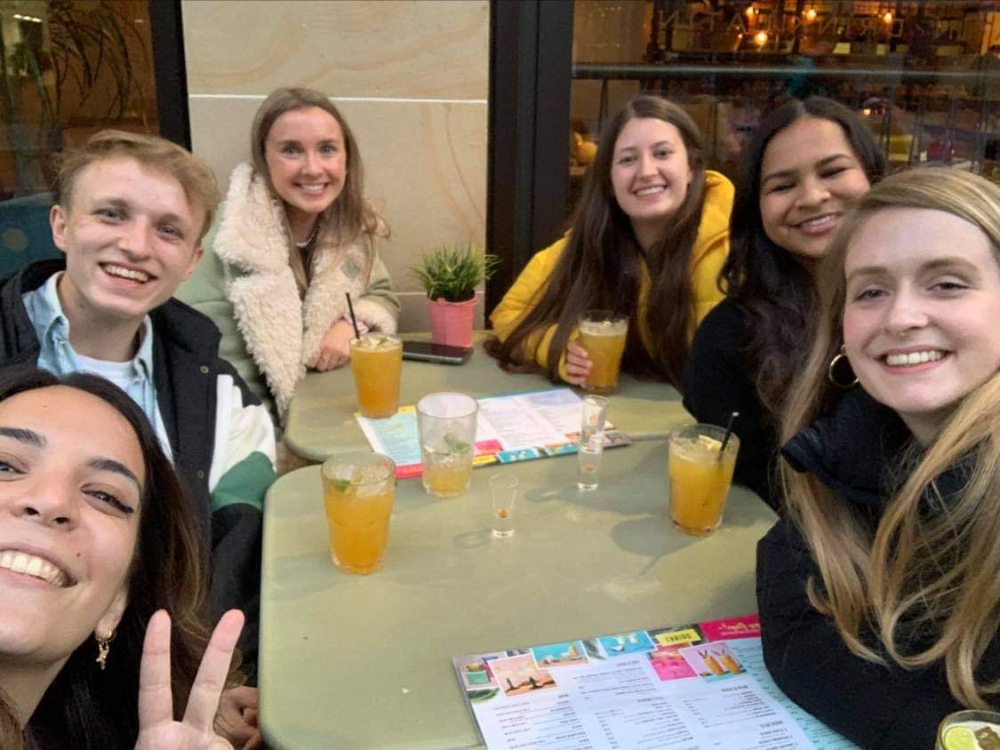
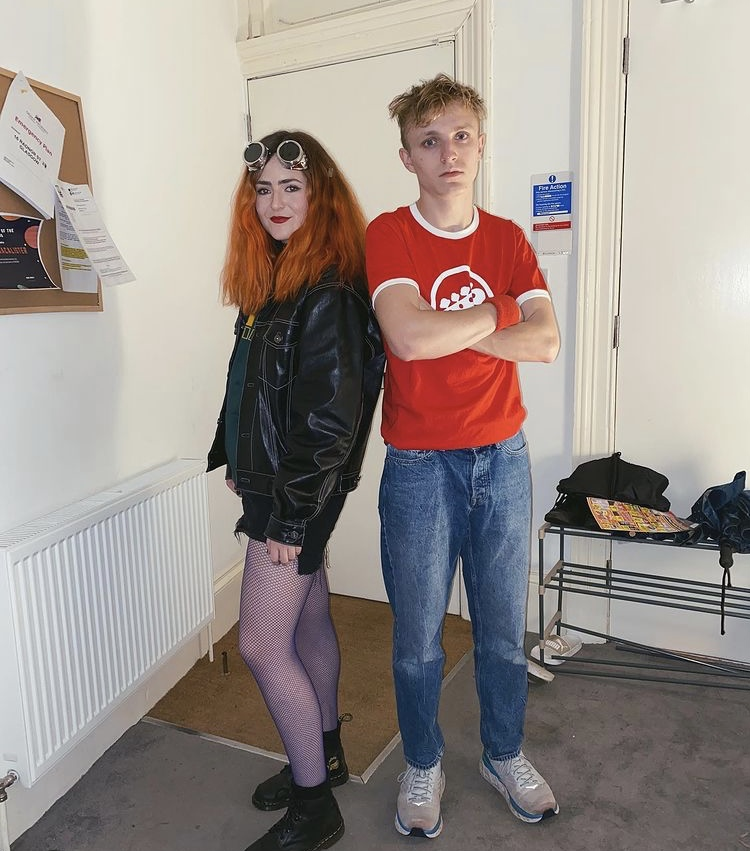
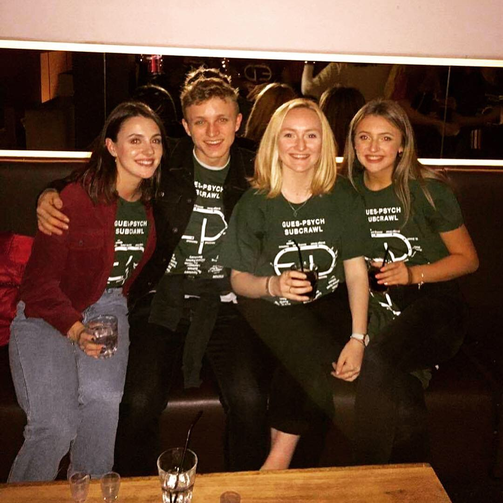
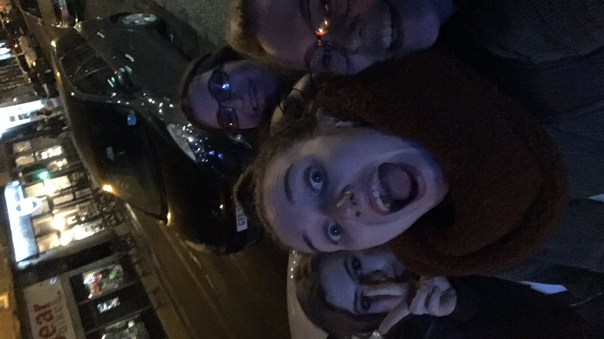
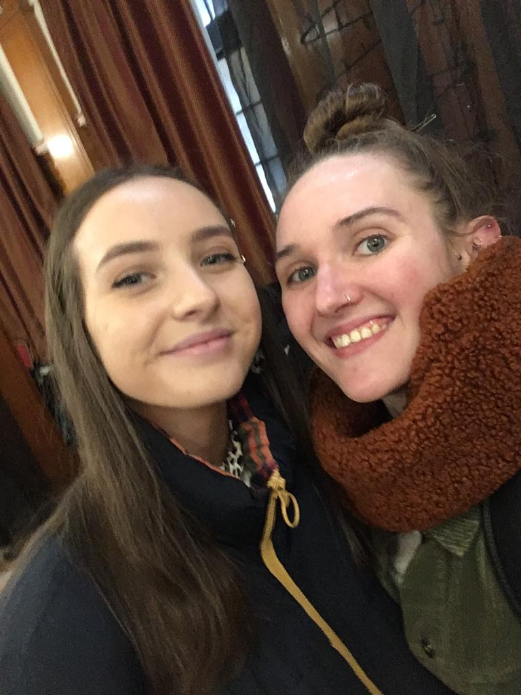
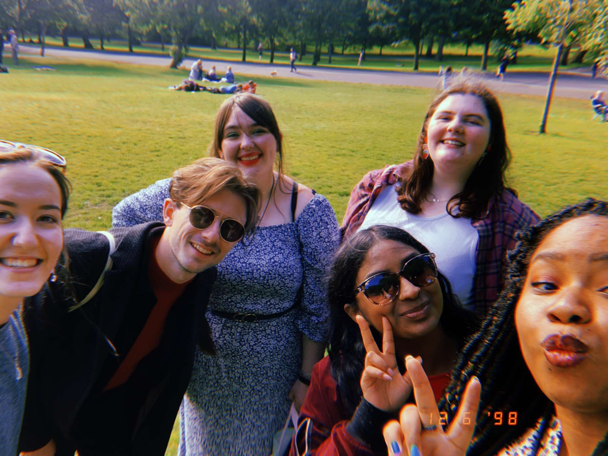
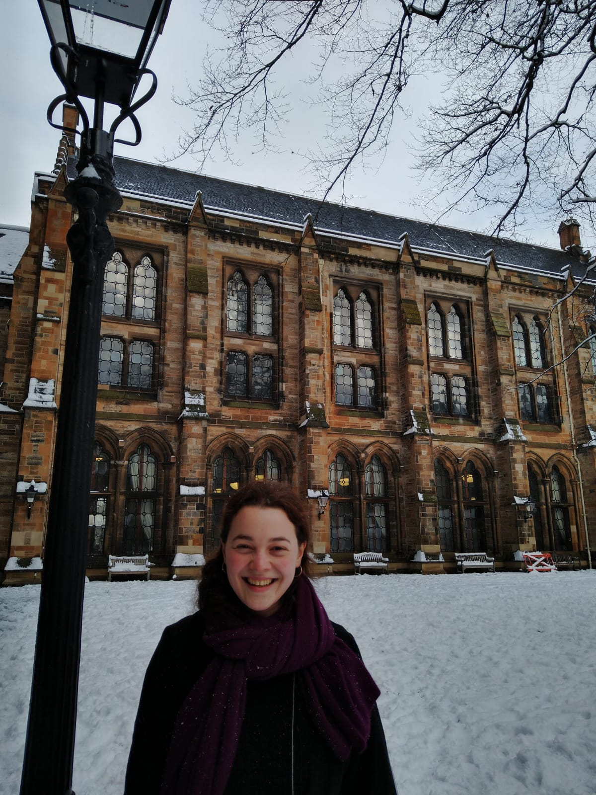

# Images of your time with us {-}

In this section you will find images and photos that people submitted to represent their year, their friends, and their dissertations.

## Us & Our Time! {-}

**Ahlen Lavaro and Friends**
 
 

 

---

**Bethany Shelton and Friends**
 
 

 

---

**Boglarka and Friends Pose for the Camera**
 
 

 

---

**Contemplative Mood by Brook Dransfield**
 
 

 

---

**Cameron and Friends**
 
 

 

---

**Cameron and More Friends **

 

 

---

**How Many Pals does Cameron Have?!**

 

 

---

**Cameron the Social Butterfly**
 
 

 

---

**Eilidh and the Crew**
 
 

 

---

**The Posh and Becks of Class of 2021**
 
 

 

---

**Cousins on Day 1**
 
 

 

---

**Party time for the Cousins**
 
 

 

---

**Lasting Friendships by Kaitlin Turner**

 

 

---

**Maria and the Hong Kong Crew**
 
 

 

---

**Maria and the Hong Kong Crew Meet Some New Friends**
 
 

 

---

**Naomi has a snow day**
 
 

 

---

**Nicola and friend having a ball**
 
 

 

---

**Noor, Who's Your Friend?**
 
 

 

---

**Noor, Who's Your Other Friend?**
 
 

 

---
