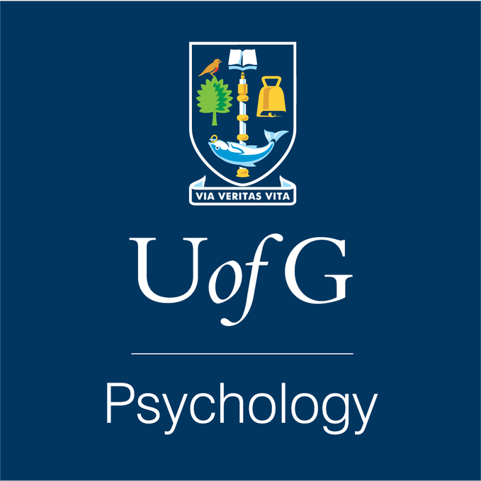
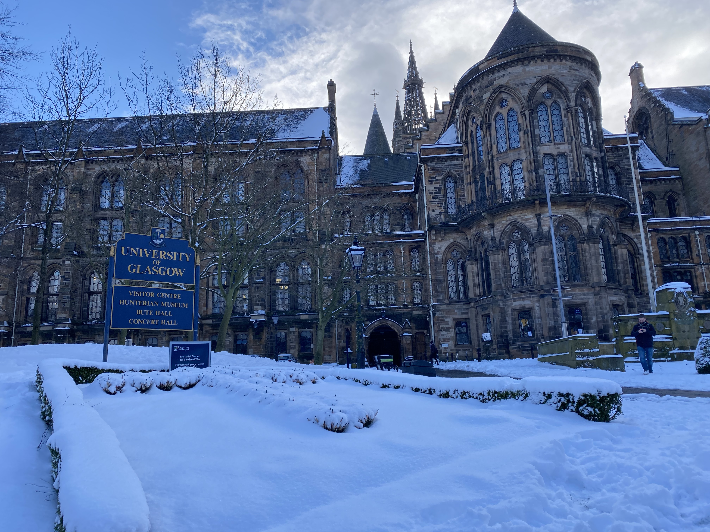

--- 
title: "Class of 2021 Yearbook"
author: "Dr Heather Cleland Woods"
date: "2021-06-24"
bibliography: packages.bib
description: UofG Psychology Class of 2021 Yearbook
documentclass: book
link-citations: yes
site: bookdown::bookdown_site
biblio-style: apalike
---

# Class of 2021 {-}

Yearbook for the University of Glasgow School of Psychology 2020-2021. 

**Programme Lead:** Dr Heather Cleland Woods.

We hope you enjoy these snapshots of your time studying Psychology at Glasgow.

---

**A Snowy Campus Trip - One Year Since My Last Lecture On Campus by Sarah Smith**
 
 

 

---
